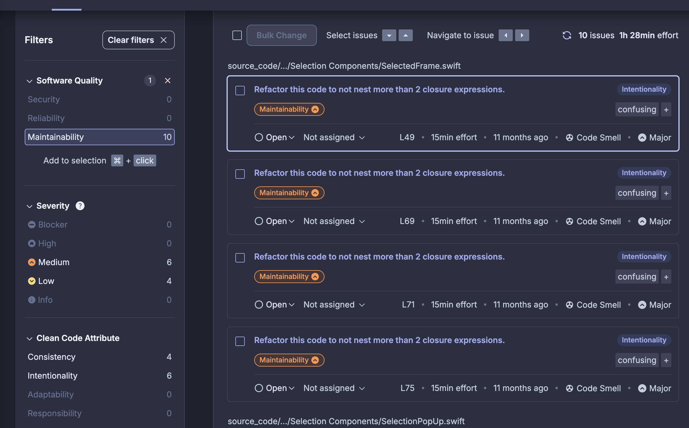

# Análise de planos do sonar cloud para o projeto ZerÓbito

## Método de precificação
- o preço é estabelecido com base no número de linhas da branch ativa com o maior número de linhas (lines of code - LOC)
- a contagem do LOC não inclui:
    - Código de teste
    - Arquivos excluidos da análise
    - Códigos escritos em linguagem não suportada
    - Comentários e linhas em branco
- o repositório público do ZerÓbito possui 21k LOC

## Planos
### Free
- a documentação diz que faz a análise de até 50k de LOC se o repositório for privado
- na prática, essa regra se aplica a repositórios públicos
- a organização deve ser pública e não conter mais de 5 membros
- a análise é feita apenas na branch main e em pull requests que apontam para a branch main

### Team
- $32 por mês
- análise abrange o projeto inteiro
- sem limites de membros ou visibilidade de repositório

### Minha experiência
Eu achei um repositório de uma organização que participei e que era aceita no plano free:

A análise apontou 10 issues para refatoração, dividindo em prioridades e para quais partes dos princípios do Clean Code esses problemas se aplicavam.

### Considerações finais
- É viável aplicar o plano free no projeto
- Para aplicar, o usuário precisa ter acesso à organização
- Das pesquisas com o linter, mais de 300 warnings são apontados. Talvez seja melhor corrigir os erros apontados pelo linter antes.