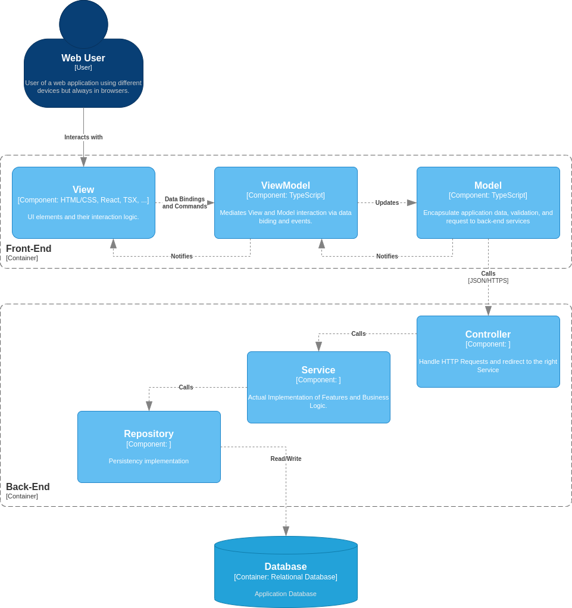

# Reference Architecture for Web Applications
## Base Architectural Styles
[MVVM](https://learn.microsoft.com/en-us/dotnet/architecture/maui/mvvm) (Model-View-ViewModel)

[Layered Architecture](https://www.baeldung.com/cs/layered-architecture)

## C4 Component Diagram

